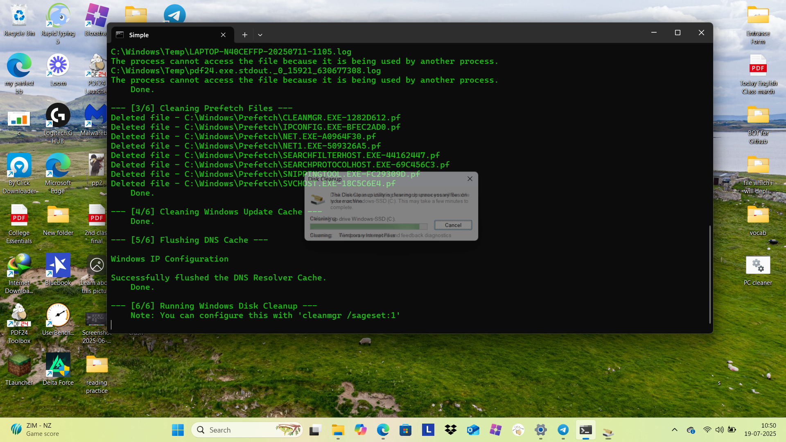

<table width="100%">
<tr>
<td width="100%" align="center">
<h1>🚀 PC-Medic: The Ultimate Windows Cleanup Script 🚀</h1>

<strong>A simple yet powerful batch script to clean, optimize, and speed up your Windows 10 & 11 PC.</strong>

</td>
</tr>
</table>

✨ Core Features
<table width="100%">
<tr valign="top">
<td width="50%">

<strong>🧹 Comprehensive Cleaning</strong>

<em>Targets Temp, Prefetch, & Windows Update caches.</em>
</td>
<td width="50%">

<strong>⚡ Performance Boost</strong>

<em>Flushes DNS and removes junk to make your PC feel faster.</em>
</td>
</tr>
<tr valign="top">
<td width="50%">

<strong>🖱️ Easy to Use</strong>

<em>No installation needed. Just download and run as admin.</em>
</td>
<td width="50%">

<strong>🛡️ Safe & Reliable</strong>

<em>Uses standard Windows commands on non-essential files.</em>
</td>
</tr>
</table>

🛠️ How to Use
Download: Grab the .bat file from the latest Release.

Run as Administrator: Right-click the file and select "Run as administrator".

Done! final result .

⚠️ Disclaimer
This script is provided as-is. Always back up important data before running any system utility. The developer is not responsible for any data loss.

❤️ Credits & Contribution
Developed by Aaditya Kumar Sah. Contributions, bug reports, and feature suggestions are welcome!
